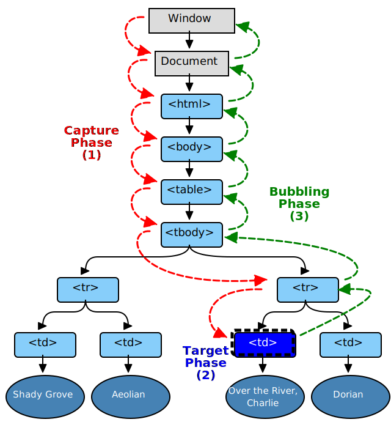

最近写一个拖拽组件，在菜鸟教程看到demo里用到了`event.preventDefault`，立刻想到了它的好基友`event.stopPropagation`，一股陌生的熟悉感油然而生，也许是习惯了框架下的岁月静好
## event.stopPropagation
js事件传播模式主要有两种：
  * ie提出的冒泡模式
  * 网景公司提出的捕获模式

两种模式都是[W3C DOM事件标准](https://www.w3.org/TR/DOM-Level-3-Events/#event-flow)的一部分：


分为三个部分：
  * 捕获阶段
  * 目标阶段
  * 冒泡阶段
  ```javascript
  /*
  * useCapture true-捕获 false-冒泡
  */
  target.addEventListener(type, listener, useCapture = false)
  ```
所有采用哪种模式决定了在dom上的监听事件的执行顺序，但是，有时候在这个dom树上的不同节点上监听了相同的动作却要执行不同的事件时，这就不是事件执行顺序能处理的了，这时候就通过`stopPropagation`（停止传播）来处理了

当某个dom节点所监听的事件类型触发时，监听函数会接收到一个事件通知（实现了 Event 接口的对象）对象，我们可以通过该对象来阻止该类事件的传播
```javascript
function listener(event) {
  event.stopPropagation()
}
```
这样，就在当前节点将事件的传播阻止了，如果是使用的捕获模式，则从`当前dom节点`到`目标节点`不会触发该类型事件；如果是使用的冒泡模式，则从`当前节点`到`window`不会触发该类型的事件
## event.preventDefault
`preventDefault`就是告诉浏览器此元素的默认动作不要做
```javascript
dom.addEventListener('click', (event)=>{
  event.preventDefault()
}, false)
```
可以阻止的默认动作很多：如a标签的href跳转，type为submit的按钮默认提交表单，内容增加后，滚动条调到最顶端，右键弹窗(`contextmenu`)等等，这些都是html元素的默认行为

`preventDefault`不会影响事件的传播
## return false
这是一个本不应该出现在这里的东西，因为jq对它做了封装，导致有时候会弄混淆。
* 在jq中
  ```javascript
  $('a').click(function () {
      // custom handling here
      return false;
  });
  ```
  `return false`将会同时调用`e.stopPropagation()`和`e.preventDefault()`
* 在原生js中，`return false`做的只是阻止后面的代码执行，跟阻止默认行为或者事件传播没任何关系


