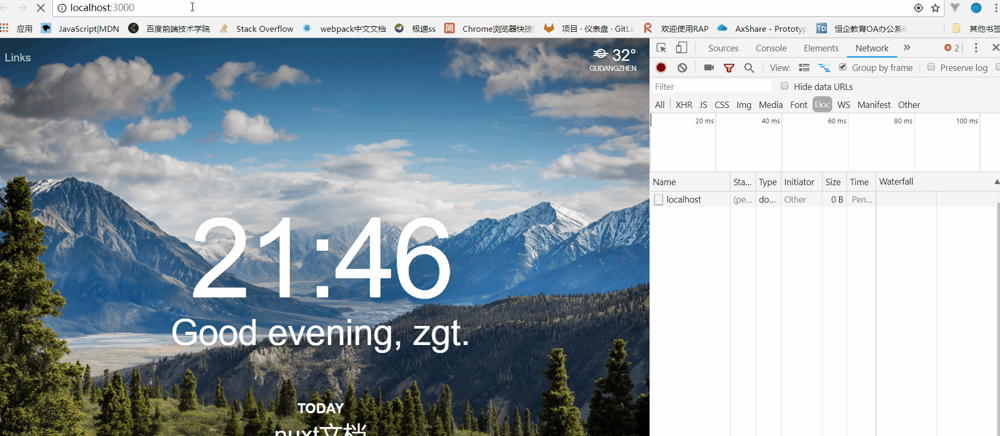
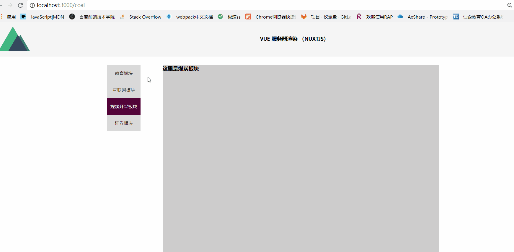

# 项目介绍

> 项目中使用用了vue + nuxt + axios + element-ui + vue-router(nuxt整合的),这是在学习服务器渲染框架nuxtjs过程中写的一个小demo；项目的接口是在rap上模拟的，这是[接口](http://rapapi.org/workspace/myWorkspace.do?projectId=35790#360635)。

# 一、效果图
### 首屏渲染

### 路由跳转

# 二、项目构建步骤
### 1、vue-cli脚手架提供了一个starter模板
```
# 安装 vue-cli
npm install -g vue-cli
# 初始化项目
vue init nuxt-community/starter-template nuxt__study
# 安装依赖
cd nuxt__study
npm install # Or yarn
# 启动本地服务
npm run dev
```
### 2、目录结构及相应介绍
```
.
├── assets          #资源目录 assets 用于组织未编译的静态资源如 LESS、SASS 或 JavaScript--就是需要webpack跟你编译的文件
│   
├── components      #不会像页面组件那样有 asyncData 方法的特性的组件--就是木偶组件（nuxt不会处理component组件里面的异步请求）
│   ├── AppLogo.vue
│   
├── layouts         #应用的布局组件--layout组件里面的<nuxt />即为服务器首屏渲染的部分（即<nuxt />外面的部分服务器不会区渲染）
│   ├── default.vue
│   
├── middleware      #中间件--这个我没用到，不过官网写的也很清楚
│  
├── nuxt.config.js  #nuxt的配置文件
├── package.json
├── pages           #页面目录 pages 用于组织应用的路由及视图。Nuxt.js 框架读取该目录下所有的 .vue 文件并自动生成对应的路由配置--业务组件&&路由
│   ├── index.vue
├── plugins         #插件目录--比如你要用element-ui啥的，都得在这个目录引入，然后再配置文件里配置
│   
├── static          #静态文件
│   ├── favicon.ico
│  
├── store           #vuex
│   
├── tree.md
└── yarn.lock
```
### 3、引入element-ui
* 在plugins目录下新建一个element-ui.js文件
``` element-ui.js
import Vue from 'vue'
import {Pagination} from 'element-ui'
import 'element-ui/lib/theme-chalk/index.css';

export default () => {
  Vue.use(Pagination);
}

```
* 然后再到nuxt.config.js文件中配置plugins
```
module.exports = {
    ...
    plugins: ['~/plugins/element-ui']
}
```
然后我们就可以在全局愉快的耍Paginations组件了
### 4、引入axios
```
yarn add axios
```
这样我们就可以直接在使用了,在api/modules/news.js
```
import axios from 'axios'
<!-- 这个请求是在服务器端渲染时请求的，要写全路径（如果前后端项目在一个服务器随便） -->
export const getNewsList = (pageIndex = 1) => axios.get('http://rapapi.org/mockjsdata/35790/home/newsList', {params: {pageIndex}})
<!-- 这个请求是在浏览器里使用的，因为我们下面配置了开发代理，所以不用写全路径 -->
export const getNewsDetailById = (id) => axios.get('/api/home/newsDetail', {params: {id}})
```
处理跨越
> 使用过 vue 的同学，肯定知道对于项目中的跨域，vue-cli 对 webpack 中的 proxy 选项进行了一层封装。它暴露出来的是一个叫 proxyTable 的选项，是对 webpack 中的 proxy 和其三方插件 http-proxy-middleware 的一个整合。
而 Nuxt 中没有 proxyTable 这么一个配置项来进行跨域的配置。但是 Nuxt 官方提供了两个包来处理 axios 跨域问题
* @nuxtjs/axios
* @nuxtjs/proxy

首先安装
```
yarn add @nuxtjs/axios @nuxtjs/proxy --dev
```
然后再nuxt.config.js里面配置下
```
modules: [
    '@nuxtjs/axios'
  ],
  axios: {
    proxy: true
  },
  proxy: {
    '/api': {
      target: 'http://rapapi.org/mockjsdata/35790',
      pathRewrite: {'^/api': ''}
    }
  }
```
这样我们的请求就会通过代理服务器转发
# 三、文件目录介绍
### layout--布局
在 layouts 目录中，default 是默认布局。我们可以修改默认布局也可以新建布局来使用。
在布局文件中 </nuxt> 标签是我们要服务器渲染的区域。
比如创建个新的
```
// layouts/page.vue
<template>
<div>
    <mt-header title="头部模块"></mt-header>
    <nuxt/>
</div>
</template>
```
如果要使page布局生效的话，我们需要早pages/index.vue配置layout（不配置就会默认是defalut布局）
```
// pages/index.vue
export default {
    ...
    layout: 'page'  // 默认是 'default'
};
```
### pages--页面
* 页面，就是在pages目录下的 *.vue 文件，Nuxt.js 将目录结构配置为 vue-router 路由系统，所以我们可以直接通过文件名来访问到相应页面。
比如 pages/demo.vue 文件就可以通过 http://localhost:3000/demo 来进行访问。
注意：页面组件写法与常用 Vue 组件写法相同，但 Nuxt.js 还提供了一些特殊配置项来配置服务器渲染过程中的行为。具体有啥配置请看页面[文档](https://zh.nuxtjs.org/guide/views#%E9%A1%B5%E9%9D%A2)。
* 路由就是使 pages 目录能够直接访问的原因。Nuxt.js 非常巧妙地使用目录结构和文件名称将 vue-router 的各种用法都涵盖进去了。如动态路由、嵌套路由等。具体可参考文档。也可以看看demo的 pages 目录。
### plugins--插件
插件的引入同element-ui
### nuxt-config.js
这里偷偷贴个别人的详细注释 [原文](http://www.debugger.fun/2018/06/05/Nuxt.js%E8%B8%A9%E5%9D%91%E8%AE%B0%EF%BC%8C%E5%88%A9%E7%94%A8Nuxt%E4%B8%80%E9%94%AE%E7%94%9F%E6%88%90%E5%A4%9A%E9%A1%B5%E9%9D%A2%E9%9D%99%E6%80%81%E7%AB%99%E7%82%B9/)
```
nuxt-demo/
├── api/                                  //- 接口
│   └── index.js
├── assets/                               //- 需要编译的静态资源，如 scss、less、stylus
│   ├── images/                           //- 图片
│   └── styles/                           //- 样式
├── build/                                //- 自定义的一些编译配置
├── components/                           //- 公用的组件
│   ├── dm-toast.vue                      //- 全局组件`dm-toast`
│   └── ...
├── data/                                 //- 静态数据
├── layouts/                              //- 布局
│   ├── components/
│   │   ├── dm-footer.vue                 //- 公用header
│   │   └── dm-header.vue                 //- 公用footer
│   └── default.vue                       //- 默认布局
├── middleware/                           //- 中间件
├── mixins/                               //- Vue mixins
├── pages/                                //- 页面
│   ├── index.vue                         //- 主页
│   └── ...
├── plugins/                              //- vue插件
│   └── dm-tracker.js/                    //- 挂载utils/tracker.js
├── static/                               //- 无需编译处理的静态资源
│   └── images/                           //- 这里存放了一些通过数据循环出来的图片
├── store/                                //- vuex
│   └── index.js
├── utils/                                //- 工具集
│   ├── index.js
│   ├── http.js                           //- axios
│   ├── tracker.js                        //- PV统计
│   └── tracker-uitl.js
├── vendor/                               //- 第三方的库和插件
│   └── index.js
├── nuxt.config.js                        //- Nuxt.js配置文件
├── seo.config.js                         //- SEO相关配置文件
├── package-lock.json                     //- npm的版本锁
├── package.json
└── README.md
项目配置
Nuxt.js 默认的配置涵盖了大部分使用情形，可通过 nuxt.config.js 来覆盖默认的配置，下面相关配置根据实际项目驱动讲解，未涉及到的配置项可查阅 Nuxt.js 文档。

nuxt.config.js 总览
module.exports = {
  //- Document Common <head>
  head: {
    meta: [
      title: '我是一个title',
      { charset: 'utf-8' },
      { name: 'viewport', content: 'width=device-width, initial-scale=1' },
      { name: 'renderer', content: 'webkit' },
      { name: 'applicable-device', content: 'pc' },
      { 'http-equiv': 'X-UA-Compatible', content: 'IE=edge,chrome=1' },
      { 'http-equiv': 'Cache-Control', content: 'no-transform' },
      { 'http-equiv': 'Cache-Control', content: 'no-siteapp' }
    ],

    link: [
      { rel: 'icon', type: 'image/x-icon', href: '你的icon地址' }
    ],

    //- 这里可以写一些每个页面需要额外引入的一些js代码，比如：百度统计
    //- `alert(1)` 仅为代码示例
    script: [{
      type: 'text/javascript',
      innerHTML: `alert(1)`
    }],

    //- __dangerouslyDisableSanitizers 设置<script>中的内容不被转义。
    //- https://github.com/declandewet/vue-meta#__dangerouslydisablesanitizers-string
    __dangerouslyDisableSanitizers: ['script']
  }

  //- 页面切换的时候进度条的颜色
  loading: { color: '#77b6ff' },

  //- modules 可以用来扩展核心功能或者添加一些集成
  //- 这里使用了一个本地开发请求远端接口的反向代理模块 `@nuxtjs/proxy`
  //- https://nuxtjs.org/api/configuration-modules
  modules: [
    '@nuxtjs/proxy'
  ],

  //- 上面 modules 中配置了 '@nuxtjs/proxy' 时，此字段才会生效
  //- https://github.com/nuxt-community/proxy-module
  proxy: {
    '/api': 'http://xxx.xxx.com'
  },

  //- 在这里注册 `Vue` 的插件、全局组件或者其他的一些需要挂载到 `Vue` 原型下面的东西
  //- ssr 为 `false` 表示该文件只会在浏览器端被打包引入
  //- https://nuxtjs.org/api/configuration-plugins
  plugins: [
    '~plugins/dm-toast',
    { src: '~plugins/dm-tracker', ssr: false }
  ],

  //- 配置全局样式文件（每个页面都会被引入）
  //- `lang` 可以为该样式文件配置相关 loader 进行转译
  css: [
    'animate.css',
    { src: '~assets/styles/common.scss', lang: 'scss' }
  ],

  //- 配置 Nuxt.js 应用生成静态站点的具体方式。
  //- https://nuxtjs.org/api/configuration-generate
  generate: {
    //- 为动态路由添加静态化
    //- 静态化站点的时候动态路由是无法被感知到的
    //- 所以可以预测性的在这里配置
    routes: [
      '/1',
      '/2',
      '/3'
      ...
    ]
  },

  //- router 属性让你可以个性化配置 Nuxt.js 应用的路由（vue-router）
  //- https://nuxtjs.org/api/configuration-router
  router: {
    //- 中间件在每次路由切换前被调用
    middleware: 'set-env',
    //- 通过 extendRoutes 来扩展或者修改 Nuxt.js 生成的路由表配置
    extendRoutes(routes) {}
  },

  //- 编译配置
  build: {
    //- 使用 webpack-bundle-analyzer 分析并可视化构建后的打包文件
    //- 你可以基于分析结果来决定如何优化它
    analyze: true,

    //- 为客户端和服务端的构建配置进行手动的扩展处理
    //- https://nuxtjs.org/api/configuration-build#extend
    extend(config, { isDev, isClient, isServer }) {
      if (isDev && isClient) {
        //- 使用 ESLint 保证代码规范
        config.module.rules.push({
          enforce: 'pre',
          test: /\.(js|vue)$/,
          loader: 'eslint-loader',
          exclude: /(node_modules)/
        })
      }
      if (!isDev) {
        config.module.rules //- 覆盖默认 `url-loader` 配置
          .find((rule) => rule.loader === 'url-loader')
            .options.name = 'images/[name].[ext]?v=[hash:7]'
      }
    },

    //- 这里可以自定义打包后的文件名
    //- `hash` 项目中任何一个文件改动后就会被重新创建
    //- `chunkhash` 是根据模块内容计算出的hash值，对应的文件发生内容变动就会重新计算
    //- 生成如下：
    //- <head>
    //-   ...
    //-   <link href="//cdn.xxx.com/manifest.js?v=8d09730" rel="preload" as="script">
    //-   <link href="//cdn.xxx.com/vendor.js?v=8d09730" rel="preload" as="script">
    //-   <link href="//cdn.xxx.com/app.js?v=fea3ec0" rel="preload" as="script">
    //-   <link href="//cdn.xxx.com/pages_index.js?v=6f7b904" rel="preload" as="script">
    //-   ...
    //- </head>
    filenames: {
      manifest: 'js/manifest.js?v=[hash:7]',
      vendor: 'js/vendor.js?v=[hash:7]',
      app: 'js/app.js?v=[chunkhash:7]',
      //- `chunk` 这里这样使用编译会报错，最后面会讲解相关解决方案
      chunk: 'js/[name].js?v=[chunkhash:7]'
    },

    //- 自定义 postcss 配置
    //- https://nuxtjs.org/api/configuration-build#postcss
    postcss: [
      require('autoprefixer')({
        browsers: ['> 1%', 'last 3 versions', 'not ie <= 8']
      })
    ],

    //- 这里可以设置你的CDN地址，生成的静态资源将会基于此CDN地址加上URL前缀
    publicPath: '//cdn.xxx.com/',

    //- Nuxt.js 允许你在生成的 vendor.js 文件中添加一些模块，以减少应用 bundle 的体积
    //- 这里说的是一些你所依赖的第三方模块 (比如 axios)，或者使用频率较高的一些自定义模块
    //- https://nuxtjs.org/api/configuration-build#vendor
    vendor: [
      'axios',
      ...
    ]
  }
}
```
# Build Setup

``` bash
# clone
$ git clone https://github.com/alowkeyguy/nuxt_study.git

$ cd nuxt_study

# install dependencies
$ yarn # or npm install

# serve with hot reload at localhost:3000
$ yarn run dev

# build for production and launch server
$ yarn run build
$ yarn start

# generate static project
$ yarn run generate
```

参考：
* [nuxtjs.org](https://zh.nuxtjs.org/guide)
* [https://zhuanlan.zhihu.com/p/37897723](https://zhuanlan.zhihu.com/p/37897723)
     
