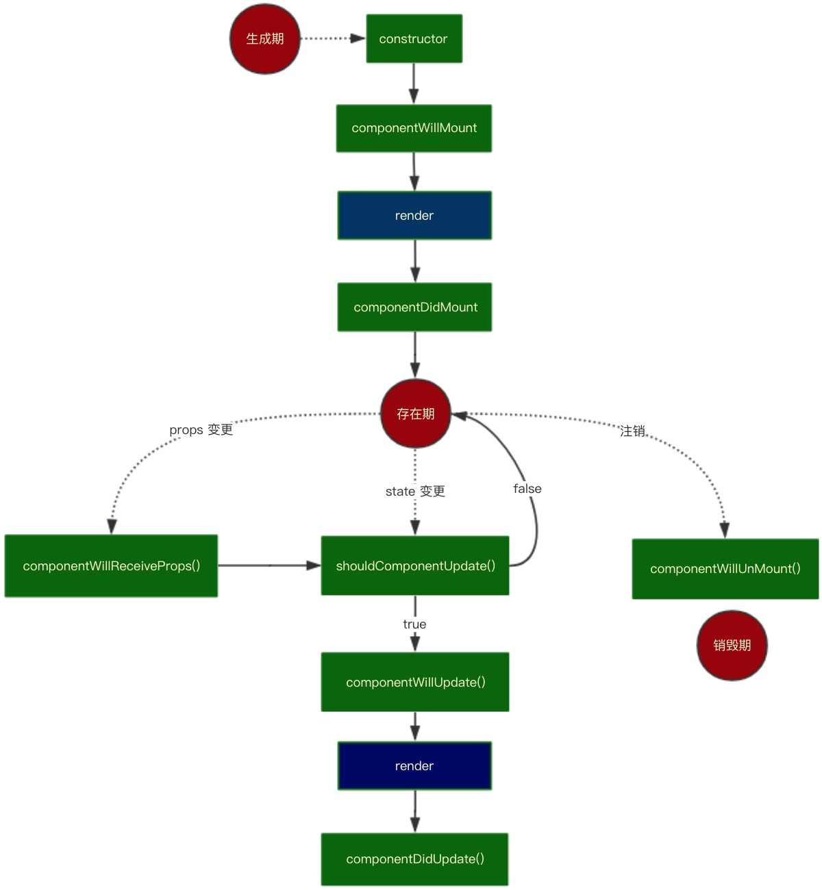
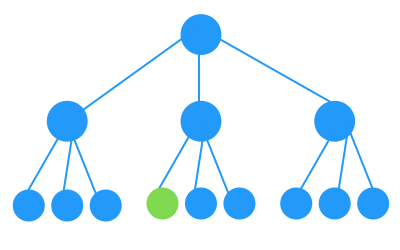
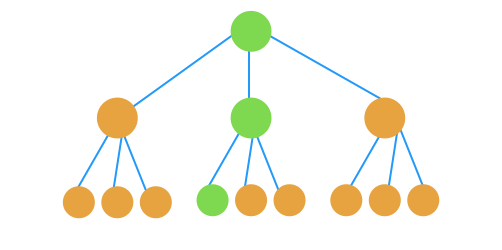
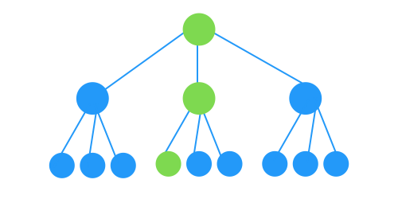

# react如何通过shouldComponentUpdate来减少重复渲染
在react开发中，都会遇到组件重复渲染这个问题
## render什么时候会触发
首先，先上一张react生命周期图：



这张图将react的生命周期分为了三个阶段：生成期、存在期、销毁期，这样在create、props、state、unMount状态变化时我们可以清楚的看到reacte触发了哪些生命周期钩子以及什么时候会render。

如果我们需要更改root的一个state，使绿色组件视图更改



如果你写过vue，你会发现组件更新是如上图那样的（视图指令已编译为修改视图的函数存放在绑定的state里的属性里，所以能够做到靶向修改），而react会以组件为根，重新渲染整个组件子树，如下图（绿色是期望的render路径，橙色是无用render）：



所以在react里，我们探讨的render性能优化是react调用render的路径如下：



## 如何避免这些不必要的render：

### shouldComponentUpdate
```
shouldComponentUpdate(nextProps, nextState)
```
使用shouldComponentUpdate()以让React知道当前状态或属性的改变是否不影响组件的输出，默认返回ture，返回false时不会重写render，而且该方法并不会在初始化渲染或当使用forceUpdate()时被调用，我们要做的只是这样：
```
shouldComponentUpdate(nextProps, nextState) {
  return nextState.someData !== this.state.someData
}
```
但是，state里的数据这么多，还有对象，还有复杂类型数据，react的理念就是拆分拆分再拆分，这么多子组件，我要每个组件都去自己一个一个对比吗？？不存在的，这么麻烦，要知道我们的终极目标是不劳而获-_-
### React.PureComponent
React.PureComponent 与 React.Component 几乎完全相同，但 React.PureComponent 通过props和state的浅对比来实现 shouldComponentUpate()。如果对象包含复杂的数据结构，它可能会因深层的数据不一致而产生错误的否定判断(表现为对象深层的数据已改变视图却没有更新）
> 关注点：
* 无论组件是否是 PureComponent，如果定义了 shouldComponentUpdate()，那么会调用它并以它的执行结果来判断是否 update。在组件未定义 shouldComponentUpdate() 的情况下，会判断该组件是否是 PureComponent，如果是的话，会对新旧 props、state 进行 shallowEqual 比较，一旦新旧不一致，会触发 update。
* 浅判等 只会比较到两个对象的 ownProperty 是否符合 [Object.js()](https://github.com/facebook/fbjs/blob/c69904a511b900266935168223063dd8772dfc40/packages/fbjs/src/core/shallowEqual.js#L39) 判等，不会递归地去深层比较---[源码](https://github.com/facebook/fbjs/blob/c69904a511b900266935168223063dd8772dfc40/packages/fbjs/src/core/shallowEqual.js#L39)
```
const hasOwnProperty = Object.prototype.hasOwnProperty;

/**
 * inlined Object.is polyfill to avoid requiring consumers ship their own
 * https://developer.mozilla.org/en-US/docs/Web/JavaScript/Reference/Global_Objects/Object/is
 */
function is(x: mixed, y: mixed): boolean {
  // SameValue algorithm
  if (x === y) { // Steps 1-5, 7-10
    // Steps 6.b-6.e: +0 != -0
    // Added the nonzero y check to make Flow happy, but it is redundant
    return x !== 0 || y !== 0 || 1 / x === 1 / y;
  } else {
    // Step 6.a: NaN == NaN
    return x !== x && y !== y;
  }
}

/**
 * Performs equality by iterating through keys on an object and returning false
 * when any key has values which are not strictly equal between the arguments.
 * Returns true when the values of all keys are strictly equal.
 */
function shallowEqual(objA: mixed, objB: mixed): boolean {
  if (is(objA, objB)) {
    return true;
  }

  if (typeof objA !== 'object' || objA === null ||
      typeof objB !== 'object' || objB === null) {
    return false;
  }

  const keysA = Object.keys(objA);
  const keysB = Object.keys(objB);

  if (keysA.length !== keysB.length) {
    return false;
  }

  // Test for A's keys different from B.
  for (let i = 0; i < keysA.length; i++) {
    if (
      !hasOwnProperty.call(objB, keysA[i]) ||
      !is(objA[keysA[i]], objB[keysA[i]])
    ) {
      return false;
    }
  }

  return true;
}
```
* 至于复杂数据结构，用Object.key()获取下key，然后key和对应的value都是基础类型数据，就是算是简单数据结构，不然就是复杂

针对以上规则我们在项目开发种可以做出如下优化：
> 尽量将复杂类型数据（ArrayList）所关联的视图单独拆成PureComonent有助于提高渲染性能，比如表单、文本域和复杂列表在同一个 render() 中，表单域的输入字段改变会频繁地触发 setState() 从而导致 组件 重新 render()。而用于渲染复杂列表的数据其实并没有变化，但由于重新触发 render()，列表还是会重新渲染。
### [react-immutable-render-mixin](https://github.com/jurassix/react-immutable-render-mixin)
我想复杂数组没变化时也不要render(), 那你用[react-immutable-render-mixin](https://github.com/jurassix/react-immutable-render-mixin)：
> Users are urged to use PureRenderMixin with facebook/immutable-js. If performance is still an issue an examination of your usage of Immutable.js should be your first path towards a solution. This library was created from experimentations with Immutable that were ultimately erroneous; improper usage of Immutable.js 💩. Users should be able to achieve maximum performance simply using PureRenderMixin.
> ***
> 译：不能以正确的姿势来使用immutable-js做优化，你就不要瞎折腾了，用它react-immutable-render-mixin就行了

它和ProComponent原理一样，唯一的区别就是新旧数据的对比，react-immutable-render-mixin用了[immutable-js](https://github.com/facebook/immutable-js) 的is()方法去做对比，性能强，复杂类型数据也能对比（这里不对immutable-js做讨论，一篇很不错的文章[Immutable 详解及 React 中实践](https://github.com/camsong/blog/issues/3)）,相比于React.PureComponent更方便---[源码](https://github.com/jurassix/react-immutable-render-mixin/blob/master/src/shallowEqualImmutable.js)
```
import Immutable from 'immutable';

const is = Immutable.is.bind(Immutable);

export default function shallowEqualImmutable(objA, objB) {
  if (objA === objB || is(objA, objB)) {
    return true;
  }

  if (typeof objA !== 'object' || objA === null ||
      typeof objB !== 'object' || objB === null) {
    return false;
  }

  const keysA = Object.keys(objA);
  const keysB = Object.keys(objB);

  if (keysA.length !== keysB.length) {
    return false;
  }

  // Test for A's keys different from B.
  const bHasOwnProperty = Object.prototype.hasOwnProperty.bind(objB);
  for (let i = 0; i < keysA.length; i++) {
    if (!bHasOwnProperty(keysA[i]) || !is(objA[keysA[i]], objB[keysA[i]])) {
      return false;
    }
  }

  return true;
}
```
用法很多，我喜欢Decorator：
```
import React from 'react';
import { immutableRenderDecorator } from 'react-immutable-render-mixin';

@immutableRenderDecorator
class Test extends React.Component {
  render() {
    return <div></div>;
  }
}
```

