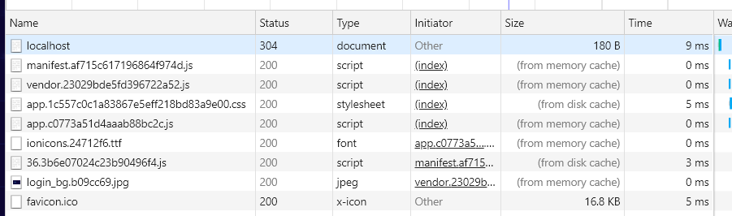
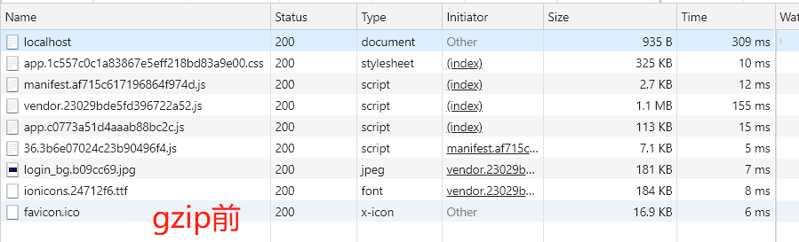
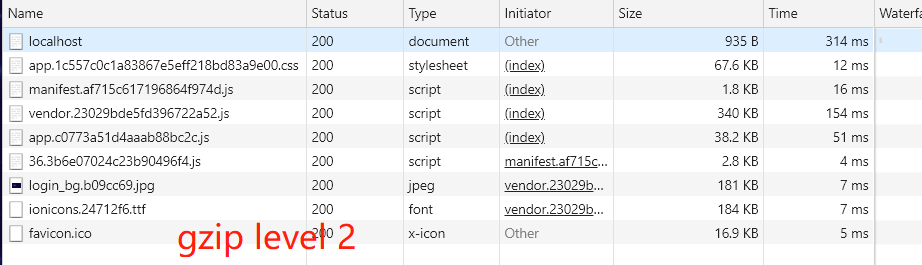

# nginx配置缓存 && gzip
* window下不要直接双击nginx.exe，这样会导致修改配置后重启、停止nginx无效，需要手动关闭任务管理器内的所有nginx进程

命令 | 名称
--------------- | ---------------
`start nginx` | 启动nginx
`nginx -s reload` | 修改配置后重新加载生效
`nginx -s reopen` | 重新打开日志文件
`nginx -t -c nginx` | 测试nginx配置文件是否正确
`nginx -s stop` | 关闭ngnix
`nginx -s quit` | 退出nginx
# 缓存配置
## 请求头
协议头 | 说明 | 示例
-------------- | -------------------------- | ---------------
Accept | 可接受的响应内容类型（Content-Types）| Accept: text/plain
Accept-Encoding | 浏览器支持的压缩传输方式 | Accept-Encoding: gzip, deflate, br
Accept-Language | 客户端声明它可以理解的自然语言 | Accept-Language: zh-CN,zh;q=0.9,en;q=0.8
Cache-Control | 本地是否有缓存 | Cache-Control: no-cache
Connection | 当前的事务完成后，是否会关闭网络连接，如果该值是“keep-alive”，网络连接就是持久的，不会关闭，使得对同一个服务器的请求可以继续在该连接上完成（HTTP/1.1默认）[持久连接](http://www.ruanyifeng.com/blog/2016/08/http.html) | Connection: keep-alive
Pragma | 它用来向后兼容只支持 HTTP/1.0 协议的缓存服务器，同catch-control | Pragma: no-cache
Referer | 表示当前页面是通过此来源页面里的链接进入的。服务端一般使用 Referer 首部识别访问来源，可能会以此进行统计分析、日志记录以及缓存优化等 | Referer: http://localhost/

## 响应头
协议头 | 说明 | 示例
---------------- | ---------------- | -----------------
Accept-Ranges | 服务器使用 HTTP 响应头 Accept-Range 标识自身支持范围请求(partial requests)。字段的具体值用于定义范围请求的单位 | Accept-Ranges: bytes
Connection | 当前的事务完成后，是否会关闭网络连接 | Connection: keep-alive
Content-Length | 描述HTTP消息实体的传输长度 | Content-Length: 1126746
Content-Type | 告诉客户端实际返回的内容的内容类型 | Content-Type: application/javascript
Date | 报文创建的日期和时间 | Date: Tue, 08 Jan 2019 09:29:35 GMT
ETag | 资源的特定版本的标识符(如果给定URL中的资源更改，则一定要生成新的Etag值) | ETag: "5bf776bf-11315a"
Last-Modified | 服务器认定的资源做出修改的日期及时间。 它通常被用作一个验证器来判断接收到的或者存储的资源是否彼此一致。由于精确度比  ETag 要低，所以这是一个备用机制。包含有  If-Modified-Since 或 If-Unmodified-Since 首部的条件请求会使用这个字段 |  Last-Modified: Fri, 23 Nov 2018 03:40:47 GMT
Server | 处理请求的源头服务器所用到的软件相关信息 | Server: nginx/1.15.7
## 缓存nginx配置
贴一段代码，具体可以参考[h5bp](https://github.com/h5bp/server-configs-nginx/blob/master/h5bp/location/web_performance_cache_expiration.conf)。在server作用域块下配置：
```conf
# Documents
location ~* \.(?:manifest|appcache|html?|xml|json)$ {
  expires 0;
}

# Feeds
location ~* \.(?:rss|atom)$ {
  expires 1h;
}

# Media files
location ~* \.(?:jpg|jpeg|gif|png|ico|cur|gz|svg|mp4|ogg|ogv|webm|htc)$ {
  access_log off;
  expires 1M;
}

# Media: svgz files are already compressed.
location ~* \.svgz$ {
  access_log off;
  gzip off;
  expires 1M;
}

# CSS and JavaScript
location ~* \.(?:css|js)$ {
  expires 1y;
  access_log off;
}
```
nginx做对应的设置后，我们在本地启一个nginx服务：

* 第一次请求（本地没有缓存）：

```
// Request Header
Accept: */*
Accept-Encoding: gzip, deflate, br
Accept-Language: zh-CN,zh;q=0.9,en;q=0.8
Cache-Control: no-cache
Connection: keep-alive
Host: localhost:8889
Pragma: no-cache

// Response Header
Accept-Ranges: bytes
Cache-Control: max-age=31536000
Cache-Control: public
Connection: keep-alive
Content-Length: 115119
Content-Type: application/javascript
Date: Tue, 08 Jan 2019 11:40:58 GMT
ETag: "5bf776bf-1c1af"
Expires: Wed, 08 Jan 2020 11:40:58 GMT
Last-Modified: Fri, 23 Nov 2018 03:40:47 GMT
Server: nginx/1.15.7
```
* 关掉，再次请求的时候：
我们可以看到，除了index.html是从资源服务器获取的外，其它的都是from catch(from dist catch / from memory catch)


在这里将除了index.html以外的所有资源文件都缓存的原因，是现在前端开发的过程中都会用webpack打包资源文件，并用hash命名，如果有改动，资源文件名字会改变，所以在这里我们只要确定用户拿到的index.html文件时最新的就行，就能确保拿到的资源文件版本没问题

# gzip
nginx配置文件[nginx.config](https://m.w3cschool.cn/nginx/nginx-d1aw28wa.html)详解

在http指令作用域块下配置：
```conf
  gzip on; #开启gzip压缩输出
  #设置允许压缩的页面最小字节数，页面字节数从header头得content-length中进行获取。默认值是20。建议设置成大于1k的字节数，小于1k可能会越压越大
  gzip_min_length 1k;
  #设置系统获取几个单位的缓存用于存储gzip的压缩结果数据流。4 16k代表以16k为单位，安装原始数据大小以16k为单位的4倍申请内存
  gzip_buffers 4 16k;
  #用于识别 http 协议的版本，早期的浏览器不支持 Gzip 压缩，用户就会看到乱码，所以为了支持前期版本加上了这个选项，如果你用了 Nginx 的反向代理并期望也启用 Gzip 压缩的话，由于末端通信是 http/1.0，故请设置为 1.0
  gzip_http_version 1.0;
  #gzip压缩等级，1压缩比最小处理速度最快，9压缩比最大但处理速度最慢(传输快但比较消耗cpu)
  gzip_comp_level 2;
  gzip_types text/plain application/javascript text/css application/xml;
  # 和http头有关系，会在响应头加个 Vary: Accept-Encoding ，可以让前端的缓存服务器缓存经过gzip压缩的页面，例如，用Squid缓存经过Nginx压缩的数据。
  gzip_vary on;
```
在开启gzip压缩前，在浏览器里看到vendor.23029bde5fd396722a52.js文件是大小是1.1m，加载时间是155ms

在开启gzip压缩后（压缩等级2），vendor.23029bde5fd396722a52.js文件大小是340kb，加载时间是：154ms

可以看到压缩效率高达70%，至于加载时间得综合压缩时间和传输时间，由于是本地环境所以这加载时间是没有参考价值的，从app.c0773a51d4aaab88bc2c.js的加载时间到是可以看出压缩过程需要时间，但是影响不大，所以nginx压缩等级的设定基本可以依据服务器的配置来定了，还有那些比较小的文件（gzip_min_length 1k）就不用压缩了，考虑到压缩时间可能会适得其反

[本文使用的nginx配置](./nginx.config)

参考：
* [浏览器的缓存机制](http://coderlt.coding.me/2016/11/21/web-cache/)
* [HTTP 协议入门](http://www.ruanyifeng.com/blog/2016/08/http.html)
* [HTTP](https://developer.mozilla.org/zh-CN/docs/Web/HTTP)
* [Nginx 配置文件nginx.conf中文详解](https://m.w3cschool.cn/nginx/nginx-d1aw28wa.html)
* [h5bp/server-configs-nginx](https://github.com/h5bp/server-configs-nginx)

