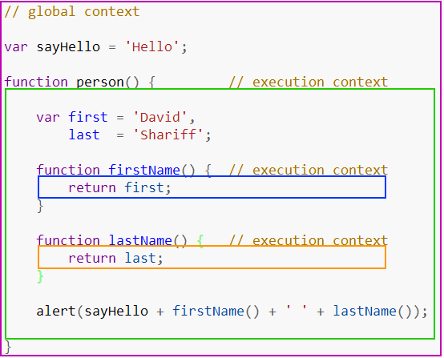

# JavaScript中的执行上下文和队列（栈）的关系？
* 原文：[What is the Execution Context & Stack in JavaScript?](http://davidshariff.com/blog/what-is-the-execution-context-in-javascript/#first-article)
* 导读：以前总是看到相关文章提到什么变量提升，函数提升啥的，什么函数提升优先级大于变量的，总是知其然，不知其所以然，当面试官拿着同一name，却不断function, 和var赋值，然后让你告诉他每一个阶段该是什么值的时候，拿着啥变量提升和函数提升是解释不通的，至少我不能-_-。David Shariff的这篇文章为我们讲述了其中的原理，让人看了豁然开朗
> 在这篇文章中，我将深入探讨JavaScript的一个最基本的部分，执行上下文。 在本文结束时，您会更清楚解释器都做了些什么，以至于某些函数、变量在声明它们之前就可以使用，它们的值是如何确定的。
## 什么是执行上下文？
当代码在JavaScript中运行时，它的执行环境非常重要，并且它们分为以下几类：
* __global 代码__ -- 首次执行代码的默认环境
* __function 代码__ -- 每当执行流程进入函数体时
* __Eval 代码__ -- 要在内部eval 函数内执行的文本

为了便于理解，本文中执行上下文是指：当前被执行的代码的环境、作用域；接下来让我们看一个执行上下文中包含global、function content的代码：



这里没有什么特别之处，1个global context由紫色边框表示，3个不同的function contexts分别由绿色、蓝色和橙色边框表示。只能有1个global context，可以从程序中的任何其他上下文访问。

您可以拥有任意数量的function contexts，并且每个函数调用都会创建一个新的上下文，从而创建一个私有作用域，在该作用域内，无法从当前函数作用域外直接访问函数内部声明的任何内容。在上面的示例中，函数可以访问在其当前上下文之外声明的变量，但外部上下文无法访问在其内部声明的变量/函数。为什么会这样？这段代码究竟是如何运行的？

## 执行上下文堆栈

浏览器中的JavaScript解释器单线程运行。这就意味着同一时间浏览器只执行一件事，其它的事件在**执行队列**中排队。下图是单线程队列的抽象视图：


我们已经知道，当浏览器首次加载您的脚本时，它默认进入**全局执行上下文（global execution contenrt）**。如果在您的全局代码中调用一个函数，程序的顺序流进入被调用的函数，创建一个新函数execution context并将该上下文推送到顶部execution stack(执行队列)。

如果在当前函数中调用另一个函数，则会发生同样的事情。代码的执行流程进入内部函数，该函数创建一个execution context并推送到执行队列的顶部。浏览器始终执行位于堆栈顶部的execution context，并且一旦函数完成执行当前操作execution context，它将从堆栈顶部弹出，将控制权返回到当前堆栈中的下方上下文。下面的例子显示了一个递归函数和程序execution stack：
```
(function foo(i) {
    if (i === 3) {
        return;
    }
    else {
        foo(++i);
    }
}(0));
```
代码只调用自身3次，将i的值递增1.每次调用foo函数时，都会创建一个新的执行上下文。一旦执行完成，它就会弹出堆栈并且将控制权交给它下面的上下文，直到再次到达global context（koa2的洋葱图想到了没？）

### 以下是执行队列的5个关键点：
* 单线程、
* 同步执行
* 全局上下文
* 无限级的函数上下文
* 每个函数调用都会创建一个新的执行上下文(execution context)，包括对自身的调用（递归）


## 执行上下文详情
所以我们现在知道每次调用函数时都会创建一个新的执行上下文（execution context） 。但是，在JavaScript解释器中，每次调用生成执行上下文（execution context）都有两个阶段：
1. __创建阶段__ [调用函数时，但在执行任何代码之前]：
> * 创建[作用域链](http://davidshariff.com/blog/javascript-scope-chain-and-closures/)。
> * 创建变量（variables），函数（functions ）和参数（arguments）
> * 确定"this"。
2. __激活/执行阶段：__
> * var 赋值，（function声明）指向函数，解释/执行代码

可以将每个execution context概念上表示为具有3个属性的对象：
```执行上下文对象
executionContextObj = {
    'scopeChain': { /* variableObject + all parent execution context's variableObject */ },
    'variableObject': { /* function arguments / parameters, inner variable and function declarations */ },
    'this': {}
}
```
## 激活/变量对象[AO / VO]
这executionContextObj是在调用函数时，但在执行实际函数之前创建的。这是第一阶段:创建阶段。这里，解释器通过扫描传入的参数或arguments、本地函数声明和局部变量声明来创建executionContextObj。这次扫描的结果就变成了executionContextObj.variableObject。
## 以下是解释器如何解析代码的伪概述：
1. 遇到函数调用。
2. 在执行function代码之前，创建执行上下文（execution context）。
3. 进入创建阶段：
    * 初始化作用域链（Scope Chain）。
    * 创建变量对象（variable object）：
        * 创建arguments object，检查参数的上下文，初始化名称和值并创建引用副本。
        * 扫描上下文以获取函数声明：
            * 对于找到的每个函数，在variable object中创建一个以函数名称为属性的键值对，值指向内存中函数的引用指针。
            * 如果函数名已存在，则将覆盖引用指针值。
        * 扫描上下文以获取变量声明：
            * 对于找到的每个变量声明，在variable object中创建一个以变量名为属性的键值对，值初始化为undefined。
            * 如果变量名已经存在于variable object，则不执行任何操作并继续扫描。
    * 确定"this"在上下文中的值。
4. 激活/执行阶段：
    * 在上下文中运行/解析函数体的代码，并在代码逐行执行时为变量赋值。

我们来看一个例子：
```
function foo(i) {
    var a = 'hello';
    var b = function privateB() {

    };
    function c() {

    }
}

foo(22);
```
在调用时foo(22)，creation stage长这样子：
```
fooExecutionContext = {
    scopeChain: { ... },
    variableObject: {
        arguments: {
            0: 22,
            length: 1
        },
        i: 22,
        c: pointer to function c()
        a: undefined,
        b: undefined
    },
    this: { ... }
}
```
正如您所看到的，creation stage定义属性的name，不为它们赋值，但formal arguments / parameters（函数传参，arguments）除外。一旦creation stage完成后，执行流程进入函数体，在函数已经完成执行之后的execution stage如下：
```
fooExecutionContext = {
    scopeChain: { ... },
    variableObject: {
        arguments: {
            0: 22,
            length: 1
        },
        i: 22,
        c: pointer to function c()
        a: 'hello',
        b: pointer to function privateB()
    },
    this: { ... }
}
```
## 提升
在很多JavaScript的资料中都提到了提升，解释变量和函数声明被提升到其作用域的顶部。但是，没有人详细解释为什么会发生这种情况，而在你掌握了关于解释器如何创建activation object后，会很容易理解。示例：
```
(function() {

    console.log(typeof foo); // function pointer
    console.log(typeof bar); // undefined

    var foo = 'hello',
        bar = function() {
            return 'world';
        };

    function foo() {
        return 'hello';
    }

}());​
```
我们现在可以回答的问题是：
* __为什么我们可以在声明它之前访问foo？__
    * 如果我们遵循creation stage，我们知道变量在activation / code execution stage之前就创建了。所以当功能流程开始执行时，foo早就在activation object中定义了。
* __foo是声明了两次，为什么显示foo的是__ function ，__不是__ undefined __或__ string？
    * 即使foo声明了两次，我们也知道在creation stage函数在变量之前就在activation objectbefore上创建了，如果属性名已经存在于activation object，解释器会忽略掉此次声明。
    * 因此，首先会在activation object上创建一个foo()的引用，当解释器到达时var foo，属性名称foo存在，所以代码什么也不做，然后继续。
* 为什么 __bar__ 是 undefined？
    * bar实际上是一个具有函数赋值的变量，我们知道变量是在creation stage创建的，但它们的初始值为undefined。
## 概要
希望到现在您已经很好地掌握了JavaScript解释器如何执行您的代码。理解执行上下文和队列可以让您了解代码没有达到预期的原因

您是否认为了解解释器的内部工作原理是您的JavaScript知识的重要组成部分？知道执行上下文的每个阶段是否有助于您编写更好的JavaScript？

__注意__：有些人一直在问关于闭包，回调，超时等，我将在在[下一篇文章](http://davidshariff.com/blog/javascript-scope-chain-and-closures/)中涉及，主要概述[作用域链](http://davidshariff.com/blog/javascript-scope-chain-and-closures/)与execution context的关系。

## 拓展
* [ECMA-262-3 in detail. Chapter 2. Variable object](http://dmitrysoshnikov.com/ecmascript/chapter-2-variable-object/)
* [Identifier Resolution, Execution Contexts and scope chains](http://jibbering.com/faq/notes/closures/)
